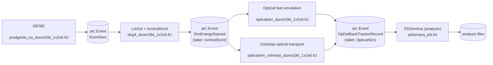

LArSoft workflow example
========================

# TL;DR

**Sequence of commands to generate analysis files from a single GENIE event:**

```sh
# Run GENIE
$ lar -c prodgenie_nu_dune10kt_1x2x6.fcl -n 1 -o genie-output.root
# Run LArG4 + IonAndScint
$ lar -c larg4_dune10kt_1x2x6.fcl -s genie-output.root -o larg4-output.root
# Run FastSim and Celeritas optical simulations
$ lar -c opticalsim_dune10kt_1x2x6.fcl -s larg4-output.root -o fastsim-output.root
$ lar -c opticalsim_celeritas_dune10kt_1x2x6.fcl -s larg4-output.root -o celeritas-output.root
# Generate analysis files
$ lar -c pdsimana_job.fcl -s fastsim-output.root
$ lar -c pdsimana_job.fcl -s celeritas-output.root
```

# Overview

The set of `fcl` job files in this example can:
- Produce neutrino events with GENIE;
- Simulate the energy deposition in LAr with Geant4;
- Propagate optical photons via
  - Fast simulation and
  - Celeritas; and
- Generate analysis files.

The following flowchart shows every step of the workflow, their respective `fcl`
job file, along with the generated data type and their `ModuleLabel`.



The next sections describe each component and their invokation, assuming
`dunesw` _and_ Celeritas are correctly set up.

# Generating GENIE samples

- Default
  [prodgenie_nu_dune10kt.fcl](https://internal.dunescience.org/doxygen/prodgenie__nu__dune10kt__1x2x6_8fcl_source.html),
  which is in your `PATH` through `dunesw`.
```sh
$ lar -c prodgenie_nu_dune10kt_1x2x6.fcl [optional: -n num_events] -o genie-output.root
```
- If `-n` is not used, the default number of events is set to 10 (defined
  upstream in
  [prodgenie_common_dunefd.fcl](https://internal.dunescience.org/doxygen/prodgenie__common__dunefd_8fcl_source.html)).
- The GENIE input configuration is also upstream, at
  [genie_dune.fcl](https://internal.dunescience.org/doxygen/genie__dune_8fcl_source.html)
  (see `Configurations for 1x2x6 geometry`).

# Running LArG4 + IonAndScint

- Use local `larg4_dune10k_1x2x6.fcl` file.
- To loop over a subset of events, replace `-s` by `-n [num_events]`.
- The GDML input geometry in `LArG4` should **_not_** tag Arapucas as `SensDet`.
```sh
$ lar -c larg4_dune10kt_1x2x6.fcl -s genie-output.root -o larg4-output.root
```

# Running optical simulations

- Use local `opticalsim*.fcl` files.
- To loop over a subset of events, replace `-s` by `-n [num_events]`.

## Fast simulation
```sh
$ lar -c dune10k_optical_1x2x6.fcl -s larg4-output.root -o fastsim-output.root
```

## Celeritas
```sh
$ lar -c dune10k_optical_celeritas_1x2x6.fcl -s larg4-output.root -o celeritas-output.root
```

- Celeritas geometry requires correct optical material information and correct
  `SensDet` data assigned to the Arapucas, e.g.:
```diff
<volume name="volOpDetSensitive_0-0-0">
  <materialref ref="LAr"/>
-  <auxiliary auxtype="PD" auxvalue="PhotonDetector"/>
+  <auxiliary auxtype="SensDet" auxvalue="PhotonDetector"/>
   <auxiliary auxtype="Surface" auxvalue="volCryostat"/>
 <solidref ref="ArapucaAcceptanceWindow"/>
</volume>
```

# Generating analysis files from the optical simulation

- Use local `pdsimana_job.fcl` file (in `src/larceler`).
- To loop over a subset of events, replace `-s` by `-n [num_events]`.
- Optional `-T`: Overrides the default analyzer output file naming scheme,
  updating the `services.TFileServices.fileName` field. This is equivalent to
  passing the full `--services.TFileService.fileName=my-output.root` path
  directly to `lar`.
- As noted in the `pdsimana.fcl` documentation, the `ModuleLabel: "OpticalSim"`
  in `pdsimana.fcl` is correct if optical simulation is generated with the local
  `*optical*.fcl` files. If fast simulation is generated from a default LArSoft
  `fcl` job, that will likely be `PDFastSim`.
```sh
$ lar -c pdsimana_job.fcl -s fastsim-output.root [optional: -T fastsim-ana-output.root]
$ lar -c pdsimana_job.fcl -s celeritas-output.root [optional: -T celeritas-ana-output.root]
```

## Note on `ModuleLabel`

- `art` stores the module labels as part of the object naming convention inside
  an `art::Event` object. If unsure about what label to use while trying to load
  an object type in `PDSimAna`, you can view it directly on ROOT. E.g., for
  `SimEnergyDeposits` objects, the `IonAndScint` label is shown as part of the
  branch name:
```sh
$ root art-file.root
root[1] Events->Print()
.
.
.
*............................................................................*
*Br   21 :sim::SimEnergyDeposits_IonAndScint__geantionandscint.obj :         *
*         | vector<sim::SimEnergyDeposit>                                    *
*Entries :       10 : Total  Size=   61060255 bytes  File Size  =   30434130 *
*Baskets :       10 : Basket Size=      16384 bytes  Compression=   2.01     *
*............................................................................*
.
.
.
```
